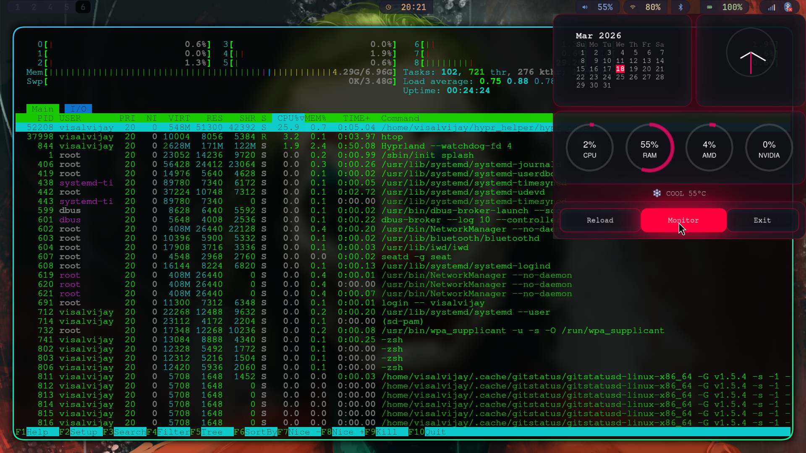

## 🔥 Preview

<p align="center">
  
  
</p>
# Hypr Helper

A GTK-based Hyprland helper panel with:

* 📅 Calendar (with current day highlight)
* 🕒 Clock
* ⚙️ CPU / RAM / GPU usage
* 🌡 CPU temperature
* 🌦 Weather (wttr.in)
* 🔘 Quick control buttons

---

## 📦 Requirements

* gtkmm3
* gtk-layer-shell
* curl
* pkg-config
* g++

### Install (Arch Linux)

```bash
sudo pacman -S gtkmm3 gtk-layer-shell curl base-devel pkgconf
```

---

## ⚙️ Build

```bash
g++ hypr_helper.cpp -o hypr_helper `pkg-config --cflags --libs gtkmm-3.0 gtk-layer-shell-0` -pthread
```

---

## ▶️ Run

```bash
./hypr_helper
```

---

## ⚠️ Notes

* Designed for **Hyprland / Wayland**
* AMD GPU usage reads from `/sys/class/drm`
* NVIDIA requires `nvidia-smi`
* Weather requires internet

---

## 👤 Author

Visal Vijay
